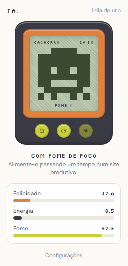
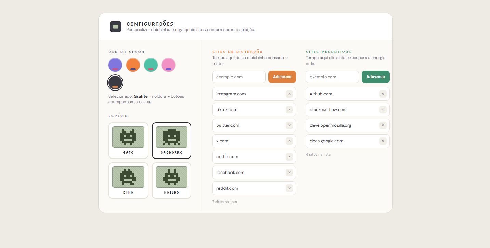

# Tamagotchi da Produtividade

Extensão de navegador (Chrome, Manifest V3) que conecta o estado de um bichinho virtual aos seus hábitos de navegação: ele fica feliz e saudável quando você evita sites de distração, e cansado/triste quando passa muito tempo neles.

O projeto é uma evolução de um jogo de Tamagotchi feito anteriormente em JavaScript puro, agora conectado a dados reais de comportamento de navegação. Une front-end/game dev com raciocínio de dados e hábitos.

**Disponível na Chrome Web Store:** https://chromewebstore.google.com/detail/njpmggaoedjeplgpjhkfnoaobhhlffad?utm_source=item-share-cb

## Screenshots

| Popup | Configurações |
|---|---|
|  |  |

Popup e Configurações compartilham o mesmo sistema visual: dispositivo Tamagotchi, paletas de cor e sprites pixel art.

## Funcionalidades

- Bichinho virtual em pixel art, com estados visuais (feliz, cansado, triste, com fome) e textos de humor contextuais, dentro de uma tela LCD estilo Tamagotchi original
- Personalização: 5 paletas de cor prontas (casca, moldura e botões) e 4 espécies de bichinho (gato, cachorro, dino, coelho)
- Rastreamento de tempo por aba/domínio, com classificação em sites de distração, produtivos e neutros
- Sistema de humor com 3 atributos (felicidade, energia e fome), que evoluem com o tempo de navegação e com o tempo real, mesmo com o navegador fechado
- Página de Configurações para adicionar/remover sites das categorias de distração e produtivos, sem precisar editar código
- Interface via popup, com contador de dias de uso e ranking dos sites mais usados no dia
- Notificações leves quando o bichinho precisa de atenção
- Persistência local via `chrome.storage`. Nenhum dado sai do navegador, sem backend

## Stack

- JavaScript (ES Modules)
- Chrome Extension Manifest V3
- `chrome.tabs`, `chrome.storage` (local e session), `chrome.alarms`, `chrome.notifications`
- Fonte `Silkscreen` (Google Fonts) para a estética pixelada da tela LCD

## Arquitetura

```
tamagotchi-produtividade/
├── manifest.json
├── background.js       # service worker: rastreamento de aba/domínio, orquestração
├── mood-rules.js         # lógica pura: classificação de domínio (lê listas do storage) e cálculo de humor
├── state.js              # persistência do estado do pet (storage.local)
├── notifications.js      # regras de notificação
├── sprites.js             # geração de pixel art por espécie x estado de humor
├── palettes.js            # 5 paletas de cor (casca, moldura, botões)
├── popup/                 # UI do popup (clique no ícone), visual de dispositivo Tamagotchi
├── options/                # página de Configurações: sites, paleta e espécie do bichinho
├── newtab/                # UI alternativa de nova aba (desativada, ver newtab/README.md)
└── icons/                  # ícones da extensão
```

**Separação de responsabilidades:**
- `mood-rules.js` cuida só da lógica pura (classificação de domínio, cálculo de humor), sem tocar em storage ou APIs do Chrome. Isso facilita testar e ajustar as regras isoladamente.
- `state.js` cuida só da persistência do estado do bichinho.
- `sprites.js` gera o pixel art combinando um corpo por espécie com variações de olho/boca conforme o humor, em vez de guardar uma matriz fixa para cada combinação.
- `background.js` orquestra tudo: escuta eventos de navegação (`chrome.tabs`, `chrome.windows`), persiste a sessão ativa em `chrome.storage.session` (sobrevive a suspensões do service worker) e roda um `chrome.alarms` periódico para decair a fome mesmo sem trocar de aba.

As listas de sites e a aparência (paleta/espécie) vivem em `chrome.storage.local` e são editadas pela página de Configurações. Nada precisa ser alterado no código para personalizar a extensão.

## Como instalar localmente

1. Clone o repositório:
   ```bash
   git clone https://github.com/seu-usuario/tamagotchi-produtividade.git
   ```
2. Abra `chrome://extensions` no Chrome.
3. Ative o **Modo do desenvolvedor** (canto superior direito).
4. Clique em **Carregar sem compactação** e selecione a pasta do projeto.
5. Clique no ícone da extensão na barra de ferramentas para ver o bichinho.

## Personalizando

Clique com o botão direito no ícone da extensão, em **Opções** (ou pelo botão de engrenagem no próprio popup), para:

- Escolher uma das 5 paletas de cor do dispositivo (Uva, Tangerina, Menta, Chiclete, Grafite)
- Escolher a espécie do bichinho
- Adicionar ou remover sites das categorias de distração e produtivos

As taxas de humor (quanto cada categoria de site afeta felicidade/energia por minuto) ficam fixas em `mood-rules.js`, caso queira ajustar o equilíbrio do jogo:

```js
const MOOD_RATE_PER_MINUTE = {
  distraction: -1,
  productive: +1,
  offline: +0.5,
  neutral: 0
};
```

## Decisões técnicas notáveis

- **`chrome.storage.session` para o estado de navegação em curso**: o service worker do Manifest V3 é suspenso após cerca de 30s de inatividade, o que apagaria variáveis comuns em memória. Persistir `currentDomain`/`sessionStart` em `storage.session` garante que o rastreamento sobreviva a essas suspensões sem precisar de polling constante.
- **`chrome.alarms` em vez de `setInterval`**: pelo mesmo motivo acima. Alarmes continuam funcionando mesmo com o service worker suspenso, e recalculam o tempo decorrido a partir de `lastUpdated` real, corrigindo automaticamente longos períodos com o navegador fechado.
- **New Tab override removido**: o Chrome não permite restaurar a nova aba nativa via código quando a extensão é desativada, então a feature foi descontinuada como padrão obrigatório. O código permanece em `newtab/` para uma futura reativação opcional (ver `newtab/README.md`).

## Próximos passos

- [ ] Tornar as taxas de humor configuráveis pela UI de Configurações
- [ ] Extrair a lógica de renderização compartilhada entre popup, options e newtab
- [ ] Reativar a nova aba como opção configurável (toggle em Configurações), em vez de override fixo
- [ ] Gráfico de histórico de humor ao longo dos dias

## Licença

MIT